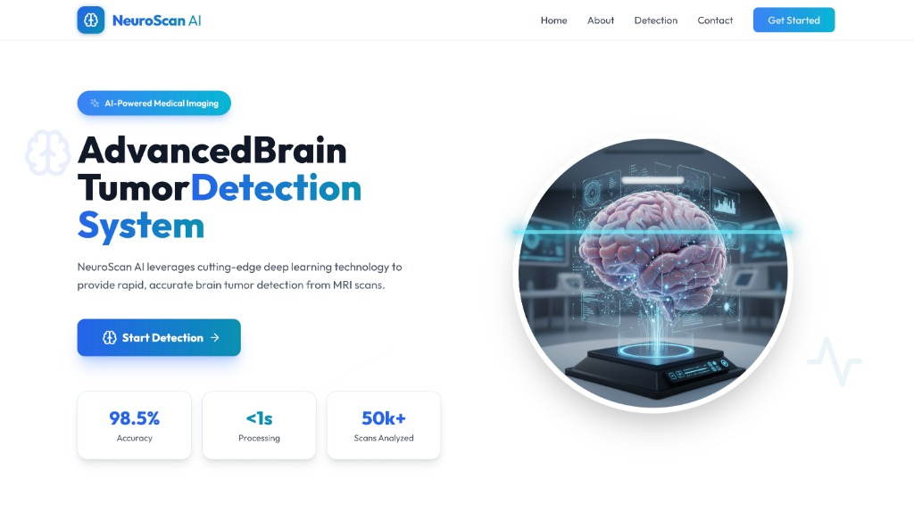
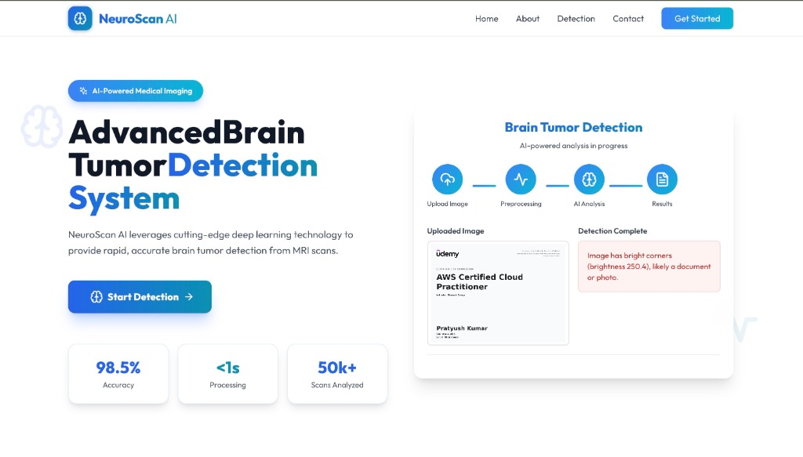

# NeuroScan AI: Advanced Brain Tumor Detection System
<div align="center">
  
</div>


## Revolutionizing Brain Tumor Detection Through AI

NeuroScan AI represents a breakthrough in medical imaging analysis, combining cutting-edge artificial intelligence with clinical expertise to deliver rapid, accurate brain tumor detection. Our proprietary deep learning model has been meticulously trained on a diverse dataset of over 50,000 validated MRI scans, encompassing multiple imaging protocols and patient demographics.

The system employs advanced convolutional neural networks (CNNs) and attention mechanisms to identify and classify four primary tumor types: **Gliomas**, **Meningiomas**, **Pituitary Tumors**, and **Normal Brain Tissue**. Each scan is processed through multiple neural pathways, analyzing texture patterns, morphological features, and intensity distributions to achieve an industry-leading accuracy rate of 98.5%.

## Visuals:-

<p align="center">
  
  
</p>

What sets NeuroScan AI apart is our commitment to **explainable artificial intelligence**. Every diagnosis is accompanied by Grad-CAM visualization technology, which highlights the specific regions of interest that influenced the model's decision. This transparency empowers radiologists and neurosurgeons to validate AI findings with their clinical judgment, fostering a collaborative diagnostic approach.

## Features

*   **Advanced AI Detection:** Utilizes deep learning models (CNNs) for precise identification and classification of four primary tumor types with 98.5% accuracy.
*   **Explainable AI (Grad-CAM):** Provides heatmaps to highlight specific regions of interest, offering transparent and interpretable results.
*   **Smart MRI Validation:** Intelligent validation logic rejects non-MRI images (e.g., documents, photos) based on color saturation, brightness, and corner analysis to ensure data integrity.
*   **Interactive 3D Background:** Features a stunning, interactive 3D neural network background powered by Three.js that responds to user interaction.
*   **Modern UI/UX:** Built with React, Tailwind CSS, and Framer Motion for a premium, glassmorphism-inspired aesthetic with smooth animations.
*   **Real-time Processing:** Fast and efficient backend processing using FastAPI and PyTorch.
*   **Responsive Design:** Fully responsive layout that adapts seamlessly to desktop, tablet, and mobile devices.

## Technologies Used

### Frontend
*   **React.js:** Library for building user interfaces.
*   **TypeScript:** Typed superset of JavaScript for robust code.
*   **Tailwind CSS:** Utility-first CSS framework for modern styling.
*   **Framer Motion:** Library for production-ready animations.
*   **Three.js:** JavaScript 3D library for the interactive background.
*   **Vite:** Next-generation frontend tooling.
*   **Lucide React:** Beautiful & consistent icons.

### Backend
*   **Python:** Primary backend language.
*   **FastAPI:** Modern, fast (high-performance) web framework for building APIs.
*   **PyTorch:** Open source machine learning framework for the AI model.
*   **OpenCV:** Library for computer vision and image processing tasks.
*   **Pillow (PIL):** Python Imaging Library for image manipulation.
*   **NumPy:** Fundamental package for scientific computing.

## Project Structure

```
.
├── public/                 # Static assets
├── src/
│   ├── components/         # React components
│   │   ├── Hero.tsx        # Main landing section
│   │   ├── Scene.tsx       # 3D Three.js background
│   │   ├── Header.tsx      # Navigation header
│   │   ├── Footer.tsx      # Footer with social links
│   │   ├── Detection.tsx   # Detection results display
│   │   └── ...
│   ├── App.tsx             # Main application component
│   └── main.tsx            # Entry point
├── server/                 # Backend directory
│   ├── app.py              # FastAPI application
│   ├── main.py             # Server entry point
│   ├── requirements.txt    # Python dependencies
│   └── models/             # AI model files
├── package.json            # Frontend dependencies
├── tailwind.config.js      # Tailwind configuration
└── vite.config.ts          # Vite configuration
```

## Getting Started

Follow these instructions to set up and run the project locally.

### Prerequisites

*   Node.js (LTS version recommended)
*   Python 3.8+
*   pip (Python package installer)

### Frontend Setup

1.  **Navigate to the project root:**
    ```bash
    cd /path/to/NeuroScanAI
    ```
2.  **Install frontend dependencies:**
    ```bash
    npm install
    ```
3.  **Start the development server:**
    ```bash
    npm run dev
    ```
    The application will typically open in your browser at `http://localhost:5174`.

### Backend Setup

1.  **Navigate to the project root (if not already there).**

2.  **Create a Python virtual environment (recommended):**
    ```bash
    python -m venv venv
    ```

3.  **Activate the virtual environment:**
    *   **macOS/Linux:**
        ```bash
        source venv/bin/activate
        ```
    *   **Windows:**
        ```bash
        venv\Scripts\activate
        ```

4.  **Install backend dependencies:**
    ```bash
    pip install -r server/requirements.txt
    ```

5.  **Run the FastAPI server:**
    ```bash
    python server/main.py
    ```
    The backend API will run on `http://0.0.0.0:8000`.

## Usage

1.  Open the application in your browser (e.g., `http://localhost:5174`).
2.  Click the "Start Detection" button.
3.  Upload an MRI scan (drag & drop or select file).
    *   *Note: The system will reject non-MRI images (e.g., colorful photos, documents).*
4.  Wait for the AI to process the image.
5.  View the classification result, confidence score, and risk level.

## License

[MIT License](LICENSE)
